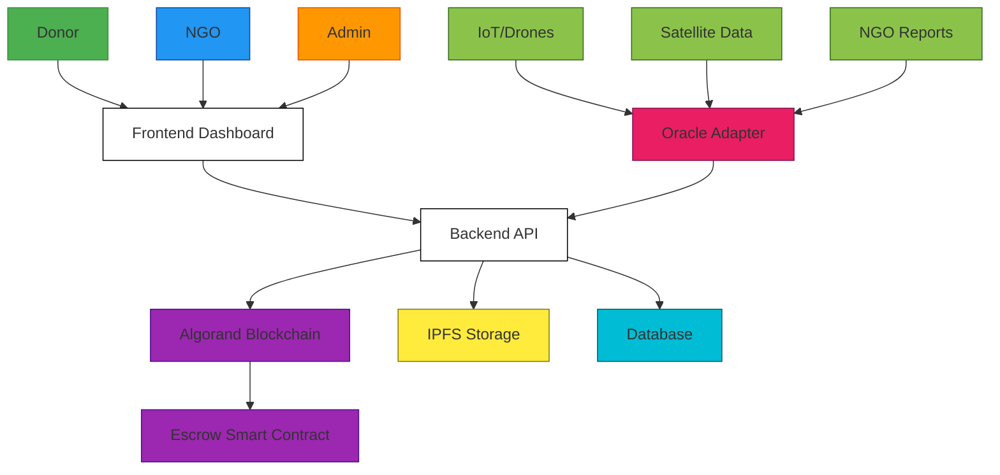

```mermaid
graph TD
    A[Donor] --> B[Frontend Dashboard]
    C[NGO] --> B
    D[Admin] --> B
    B --> E[Backend API]
    E --> F[Algorand Blockchain]
    E --> G[IPFS Storage]
    E --> H[Database]
    F --> I[Escrow Smart Contract]
    J[IoT/Drones] --> K[Oracle Adapter]
    L[Satellite Data] --> K
    M[NGO Reports] --> K
    K --> E
    
    style A fill:#4CAF50,stroke:#388E3C
    style C fill:#2196F3,stroke:#0D47A1
    style D fill:#FF9800,stroke:#E65100
    style B fill:#FFFFFF,stroke:#000000
    style E fill:#FFFFFF,stroke:#000000
    style F fill:#9C27B0,stroke:#4A148C
    style G fill:#FFEB3B,stroke:#827717
    style H fill:#00BCD4,stroke:#006064
    style I fill:#9C27B0,stroke:#4A148C
    style J fill:#8BC34A,stroke:#33691E
    style K fill:#E91E63,stroke:#880E4F
    style L fill:#8BC34A,stroke:#33691E
    style M fill:#8BC34A,stroke:#33691E
```