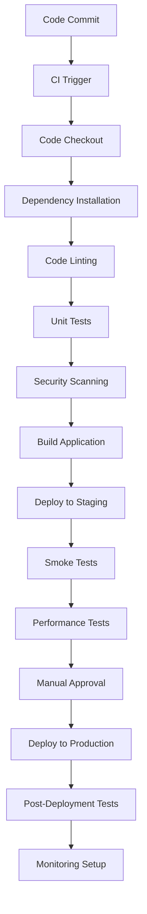

# CI/CD Pipeline Documentation

This document describes the Continuous Integration and Continuous Deployment (CI/CD) pipeline for the ImpactX disaster response platform, including build processes, testing strategies, deployment workflows, and monitoring procedures.

## Overview

The ImpactX CI/CD pipeline automates the process of building, testing, and deploying the application, ensuring consistent, reliable, and rapid delivery of features and fixes while maintaining high quality standards.

## Pipeline Architecture



## CI/CD Platform

- **Primary Platform**: GitHub Actions
- **Backup Platform**: GitLab CI (for redundancy)
- **Container Registry**: Docker Hub
- **Artifact Storage**: GitHub Packages

## Workflow Stages

### 1. Continuous Integration (CI)

#### Trigger Events

- Push to `main` branch
- Pull request creation/update
- Manual trigger

#### CI Jobs

1. **Code Checkout**
   - Clone repository
   - Checkout specific branch/commit
   - Set up Git LFS for large files

2. **Dependency Installation**
   ```bash
   npm ci
   ```

3. **Code Linting**
   ```bash
   npm run lint
   npm run lint:css
   ```

4. **Security Scanning**
   - Dependency vulnerability scanning
   - Static application security testing (SAST)
   - Secret scanning

5. **Unit Testing**
   ```bash
   npm run test:coverage
   ```

6. **Integration Testing**
   ```bash
   npm run test:integration
   ```

7. **Code Quality Analysis**
   - SonarQube analysis
   - Code coverage reporting
   - Technical debt assessment

8. **Build Application**
   ```bash
   npm run build
   ```

9. **Container Image Build**
   ```dockerfile
   # Dockerfile for frontend
   FROM node:16-alpine AS build
   WORKDIR /app
   COPY package*.json ./
   RUN npm ci --only=production
   COPY . .
   RUN npm run build
   
   FROM nginx:alpine
   COPY --from=build /app/dist /usr/share/nginx/html
   COPY nginx.conf /etc/nginx/nginx.conf
   ```

### 2. Continuous Deployment (CD)

#### Staging Environment

Deployed automatically after successful CI for non-main branches.

**Staging URL**: https://staging.impactx.example.com

**Deployment Process**:
1. Build Docker images
2. Push to container registry
3. Deploy to Kubernetes cluster
4. Run smoke tests
5. Update deployment status

#### Production Environment

Deployed manually after approval for main branch.

**Production URL**: https://impactx.example.com

**Deployment Process**:
1. Manual approval required
2. Blue-green deployment strategy
3. Health checks and rollbacks
4. Post-deployment verification

## GitHub Actions Workflow

### Main Workflow (.github/workflows/ci-cd.yml)

```yaml
name: CI/CD Pipeline

on:
  push:
    branches: [ main, develop ]
  pull_request:
    branches: [ main ]

jobs:
  build:
    runs-on: ubuntu-latest
    
    strategy:
      matrix:
        node-version: [16.x, 18.x]
        
    steps:
    - uses: actions/checkout@v3
    
    - name: Use Node.js ${{ matrix.node-version }}
      uses: actions/setup-node@v3
      with:
        node-version: ${{ matrix.node-version }}
        cache: 'npm'
        
    - name: Install dependencies
      run: npm ci
      
    - name: Lint code
      run: npm run lint
      
    - name: Run unit tests
      run: npm run test:coverage
      
    - name: Run security scan
      run: npm run security:scan
      
    - name: Build application
      run: npm run build
      
    - name: Upload coverage to Codecov
      uses: codecov/codecov-action@v3

  deploy-staging:
    needs: build
    runs-on: ubuntu-latest
    if: github.ref == 'refs/heads/develop'
    
    steps:
    - uses: actions/checkout@v3
    
    - name: Deploy to staging
      run: |
        echo "Deploying to staging environment"
        # Deployment commands here
        
  deploy-production:
    needs: build
    runs-on: ubuntu-latest
    if: github.ref == 'refs/heads/main'
    
    environment:
      name: production
      url: https://impactx.example.com
      
    steps:
    - uses: actions/checkout@v3
    
    - name: Wait for approval
      uses: trstringer/manual-approval@v1
      with:
        secret: ${{ secrets.APPROVAL_TOKEN }}
        approvers: ${{ secrets.APPROVERS }}
        
    - name: Deploy to production
      run: |
        echo "Deploying to production environment"
        # Deployment commands here
```

## Testing Strategy

### Automated Testing

#### Unit Tests

- Coverage target: 85% minimum
- Run on every commit
- Parallel execution for faster feedback
- Results published to CI dashboard

#### Integration Tests

- Test API endpoints
- Database integration tests
- External service mocking
- Run on staging deployments

#### End-to-End Tests

- Browser automation with Cypress
- Critical user flows testing
- Cross-browser compatibility
- Run on staging environment

#### Performance Tests

- Load testing with Artillery
- Stress testing scenarios
- Response time monitoring
- Run during deployment process

### Manual Testing

#### Smoke Tests

Performed after each deployment:

1. Application loads successfully
2. User can log in
3. Main dashboard displays
4. Critical features accessible

#### Regression Tests

Before major releases:

1. Full functionality verification
2. Cross-module integration
3. Data integrity checks
4. Security validation

## Deployment Strategies

### Blue-Green Deployment

For production deployments:

1. Deploy new version to inactive environment (green)
2. Run health checks on green environment
3. Switch traffic from blue to green
4. Monitor green environment
5. Decommission blue environment after verification

### Canary Deployment

For high-risk releases:

1. Deploy to small subset of users (1%)
2. Monitor key metrics
3. Gradually increase traffic (5%, 10%, 25%, 50%, 100%)
4. Rollback if issues detected

### Rollback Procedures

#### Automated Rollback

Triggered by:
- Health check failures
- Error rate thresholds exceeded
- Performance degradation

Process:
1. Automatic detection of deployment issues
2. Immediate rollback to previous version
3. Alert notification to team
4. Investigation and resolution

#### Manual Rollback

Process:
1. Team decision to rollback
2. Execute rollback script
3. Verify system stability
4. Communicate status to stakeholders

## Environment Configuration

### Environment Variables

#### Development
```bash
NODE_ENV=development
API_URL=http://localhost:3001/api
DEBUG=true
```

#### Staging
```bash
NODE_ENV=production
API_URL=https://staging-api.impactx.example.com
DEBUG=false
```

#### Production
```bash
NODE_ENV=production
API_URL=https://api.impactx.example.com
DEBUG=false
```

### Configuration Management

- Use `.env` files for local development
- Use Kubernetes ConfigMaps for runtime configuration
- Use Secrets for sensitive data
- Environment-specific configuration files

## Monitoring and Observability

### Application Monitoring

#### Metrics Collection

- Response times
- Error rates
- Throughput
- Resource utilization
- Business metrics

#### Logging

Structured logging format:
```json
{
  "timestamp": "2023-01-01T12:00:00Z",
  "level": "info",
  "service": "impactx-frontend",
  "traceId": "abc123",
  "message": "User login successful",
  "userId": "user123"
}
```

#### Tracing

- Distributed tracing with OpenTelemetry
- Trace propagation across services
- Performance bottleneck identification
- Error propagation tracking

### Infrastructure Monitoring

#### Kubernetes Monitoring

- Node resource utilization
- Pod health status
- Network connectivity
- Storage usage

#### Database Monitoring

- Query performance
- Connection pool usage
- Backup status
- Replication lag

### Alerting

#### Alert Thresholds

- **Critical**: Immediate response required (pages)
- **Warning**: Attention within 1 hour (emails)
- **Info**: Informational (dashboard)

#### Alert Channels

- PagerDuty for critical alerts
- Slack for team notifications
- Email for non-urgent alerts
- Dashboard for trend monitoring

## Security Considerations

### Pipeline Security

#### Credential Management

- Use GitHub Secrets for sensitive data
- Rotate credentials regularly
- Principle of least privilege
- Audit credential usage

#### Code Security

- Dependency scanning
- Static code analysis
- Secret detection
- Security policy enforcement

### Deployment Security

#### Image Security

- Signed container images
- Vulnerability scanning
- Base image hardening
- Runtime security monitoring

#### Network Security

- Network policies enforcement
- Service mesh for microservices
- TLS encryption everywhere
- Ingress/egress filtering

## Performance Optimization

### Build Optimization

#### Caching Strategies

- Dependency caching
- Build artifact caching
- Docker layer caching
- Test result caching

#### Parallelization

- Matrix builds for multiple Node.js versions
- Parallel test execution
- Concurrent deployment tasks
- Distributed builds

### Deployment Optimization

#### Resource Management

- Optimal container resource limits
- Horizontal pod autoscaling
- Cluster resource optimization
- Cost efficiency monitoring

## Rollout Process

### Pre-Deployment Checklist

- [ ] Code review completed
- [ ] Tests passing
- [ ] Security scan clean
- [ ] Performance benchmarks met
- [ ] Documentation updated
- [ ] Stakeholder approval obtained

### Deployment Steps

1. **Preparation**
   - Verify environment readiness
   - Confirm deployment window
   - Notify stakeholders

2. **Execution**
   - Trigger deployment pipeline
   - Monitor deployment progress
   - Validate intermediate steps

3. **Verification**
   - Run post-deployment tests
   - Monitor system health
   - Validate business metrics

4. **Completion**
   - Update deployment records
   - Communicate success to team
   - Schedule post-mortem if needed

### Post-Deployment Activities

#### Monitoring

- Enhanced monitoring for first 24 hours
- Key metric tracking
- User feedback collection
- Performance benchmarking

#### Rollback Readiness

- Maintain previous version artifacts
- Keep rollback procedures ready
- Monitor rollback triggers
- Document rollback execution

## Disaster Recovery

### Backup Strategy

#### Code Backup

- GitHub repository mirroring
- Regular code snapshots
- Branch protection rules
- Release tagging

#### Data Backup

- Automated database backups
- Point-in-time recovery capability
- Cross-region replication
- Regular backup testing

### Recovery Procedures

#### Application Recovery

1. Identify failure root cause
2. Attempt service restart
3. Deploy from backup if needed
4. Validate system integrity
5. Communicate status

#### Data Recovery

1. Assess data loss extent
2. Identify latest clean backup
3. Execute restore procedure
4. Validate data integrity
5. Resume normal operations

## Cost Management

### Resource Optimization

#### Compute Resources

- Right-size container resources
- Implement auto-scaling
- Use spot instances where appropriate
- Monitor resource utilization

#### Storage Optimization

- Implement data retention policies
- Use compressed storage formats
- Archive old data
- Monitor storage costs

### Pipeline Optimization

#### Execution Time

- Optimize build times
- Reduce test execution time
- Parallelize where possible
- Cache dependencies

#### Resource Usage

- Monitor pipeline resource consumption
- Optimize job scheduling
- Use appropriate runner types
- Implement cleanup procedures

## Best Practices

### Git Workflow

#### Branching Strategy

- Main branch for production code
- Develop branch for integration
- Feature branches for new development
- Release branches for stabilization

#### Commit Guidelines

- Atomic commits
- Descriptive commit messages
- Reference issue numbers
- Follow conventional commits

### Code Quality

#### Review Process

- Mandatory code reviews
- Automated quality gates
- Security review for sensitive changes
- Performance impact assessment

#### Standards Enforcement

- Linting rules enforcement
- Code formatting standards
- Security policy compliance
- Documentation requirements

## Troubleshooting

### Common Issues

#### Build Failures

- Dependency resolution issues
- Linting errors
- Test failures
- Security vulnerabilities

#### Deployment Failures

- Configuration errors
- Resource limits exceeded
- Health check failures
- Network connectivity issues

### Debugging Procedures

#### CI Issues

1. Check job logs
2. Verify environment setup
3. Validate configuration
4. Test locally if needed

#### CD Issues

1. Check deployment logs
2. Verify environment status
3. Validate configuration
4. Review recent changes

## Future Improvements

### Planned Enhancements

#### Automation Improvements

- AI-powered test selection
- Predictive deployment analysis
- Automated rollback optimization
- Self-healing infrastructure

#### Monitoring Enhancements

- Advanced anomaly detection
- Predictive failure analysis
- Enhanced user experience monitoring
- Business impact correlation

#### Security Improvements

- Zero-trust deployment model
- Advanced threat detection
- Automated compliance verification
- Enhanced secret management

This CI/CD pipeline documentation provides a comprehensive guide to the automated processes that ensure the ImpactX platform is built, tested, and deployed with high quality and reliability.